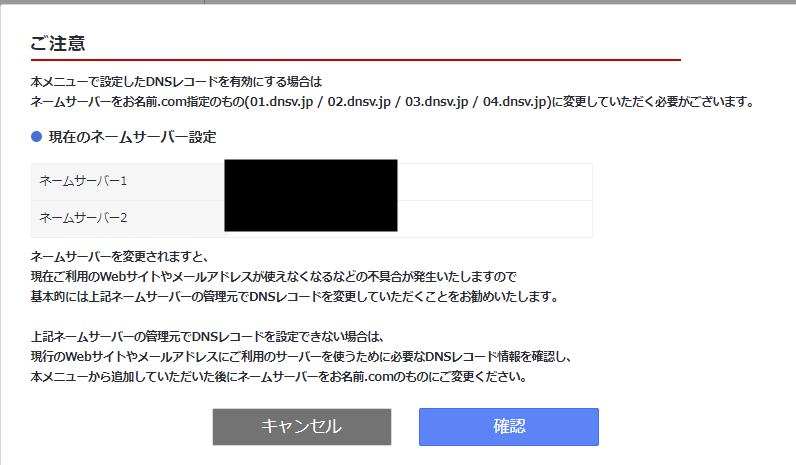
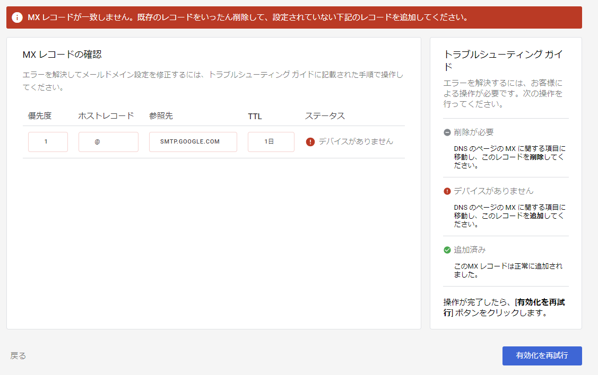
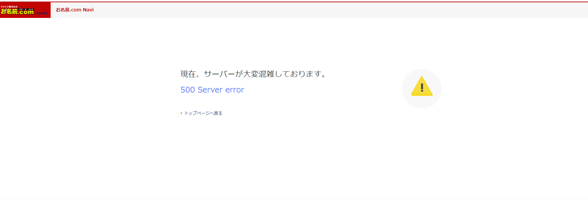

## はじめに

様々な成り行きで過去にWordPressのサイトを気合で立ち上げ、わけがわからなくなりながらやればできる！と徹夜でググりながらカスタマイズしたり運営してきたのですが、なんと大本のレンタルサーバZ.com WPがサービス終了という驚愕のお知らせが飛び込んできて早1か月、いよいよ6月末のサービス終了の期日が目前に来てしまったので、なんとかかんとか別サーバーに移行しないといけなくなりました。

しかし今のところ何の知識も、どころか、今までどんな設定をこねくり回していたのかの記憶もありません。どうしたらいいんだ。

と言っていてもこの週末を逃すともうノーチャンスなので、何とか調べながら完了する必要があります。折角調べるので、いずれ何かの役に立ったり、後で思い出す必要が出てきたりするかも、ということで記録を残すことにしました。

## やらなあかんこと

そもそも常に気を失いながら作業をしてきたのでZ.com 上に何が置いてあるのかが怪しいです。色々とあさってみたところ、、、どうにかしないといけないのは以下の3項目のようです。

- Wordpressで構築したWEBページ（ブログ）
- Z.com WPの無料オプションサービスで構築したメールサーバ
- Z.com で取得したドメイン（ドメイン部分も今回サービス終了してしまう）

このうち最初の2つは今後も引き続き使い続けるのでどこかへ移行、最後のドメインは、取ったことすら忘れていたくらいの利用していないものなのでこれを機に手放そうと思います。返金あるといいな・・・

## 移行先

新たにレンタルサーバを契約してWordpressを立ち上げて行く、という選択肢もあるのですが、これまでの経験から知識ゼロの人間が意識朦朧としながらググる程度では、大したこともできないし、そもそも自分以外の人が更新もできない状態だとまともな運営もできません。
というわけでいっそWPは諦めてノーコードで構築・更新ができるWEBページに移行することにします。
併せてメールサーバも移行する必要があります。
それぞれ折角独自ドメインを取得して運営してきたので、そこは継続して使用したいところです。

これらをすべて満たして、かつ低コスト・低負担で移行できる移行先を考えて行ったところ・・・

### ノーコードWEBサイト構築

よくあるノーコード比較サイト（https://liginc.co.jp/611425 など）を参考に、有名どころをピックアップしてみます。もう移行作業はやりたくないので、いつ終わるかわからないマイナーサービスは今回対象外にし、可能な限りメジャーで売れてるサービスを採用することにします。

有名どころを調べてみると・・・

| サービス名 | 独自ドメイン利用料金 | 備考 | 
| ---- | ---- | ---- | 
| STUDIO | 980円/月 |　ブログも運営できる |
| ペライチ | 1465円/月 |　3ページまで作成 |
| WIX | 500円/月 |　データ容量500MB、複雑な動きも〇 |
| Notion | 8ドル/月 |　なんかスタートアップとかが使いこなしてるイメージ、やってみたい。しかし[独自ドメインで公開するには別の有料サービスと組み合わせる必要](https://notion-lab.jp/2024-01-11-share-to-web/)があるみたい。 |

という感じ。

### メールサーバ

続いてメールサービスですが、

| サービス名 | 利用料金 | 備考 | 
| ---- | ---- | ---- | 
| お名前ドットコム | 177円/月 |　ドメインを取得したサービスだし楽。 |

・・・ていうかそれ以外の選択肢がわからない・・・WEBページをレンタルサーバ上に構築する場合は同じサーバで提供されるメールサービスを使えば良さそうなのですが、生憎ノーコードWEBサービスはメールサーバは提供していない場合がほとんど。しかしメールサーバの設定もなんかめんどかったよなーとか思い出してきて気が乗りません。

### GWS!

と、いうところで天啓が。GWSで良くない？独自ドメインでGmailを利用して、ついでにノーコードサイト構築のGoogleサイトも使えます。
料金は・・・？680円/月・ユーザ。
管理者はほぼ一人なので費用面でも安く済みそうです。

Google本体から購入するより、販売代理店から購入するほうがサポートもあり、かつ安いようです。このあたりは最近仕事でAWSの調達を丁度やっているのですが同じ構造ですね。ただ、いくつか見てみると割引は5アカウント以上からとなっていたり、申込をして担当からの連絡を待たないといけなかったりと微妙に条件が合わないのと、後から乗り換えも可能なようなので、今回は公式から購入することにします。

というわけでGWSのアカウントを契約し、WEBページはGoogleサイトで更新、Gmailに独自ドメインと設定してメール利用、ついでにBloggerを連携してブログ機能を実装することにします。
また、Google meetの長時間WEB会議もついてくる点も嬉しい誤算です。

## 実行していく！

実行後、待ち時間が発生しそうなタスクから順番に手を付けていきたいところです。
とはいえ何が何だかさっぱり。色々と調べてみた結果、、、やるべき作業と待ち時間、必要時間の見積もりは以下の通りの雰囲気です。

| タスク | 待ち時間 | 必要時間 |
| ---- | ---- | ---- |
| GWS契約 | ？ | すぐでは？ |
| WPのデータバックアップ | かなり長そうだ | やり方を調べるところから。長そう |
| GWSのメール移行設定 |  | やり方を調べるところから。長そう |
| ドメイン移行設定 | なんか浸透？に時間が掛かるとか | やり方を調べるところから。長そう |
| Googleサイトの構築 | すぐ | 最低限の内容入れるだけなら1時間くらいで終わるでしょう |
| Bloggerの連携 | すぐ | やり方を調べるところからではあるけど、まあできるでしょう |

はい、結構わからんことが多い。とはいえまずはドメインの移行が謎の待ち時間がありそうなので、そこを進めてみることにします。WPのバックアップは、最悪平日に待っておけば終わるのですが、ドメイン移行はそこからの作業が多いので。。

てなわけでまずはGWSを契約！

### 追加事項

ここにきて、WP動かしてるサイトが、メールアカウントと違うドメインになっていたことが分かりました。経緯は完全に忘れました。どうしよう。

→メインでGWSに登録したドメインはコーポレート？的な扱いとして、[セカンダリドメインとして上記ドメインをGWSへ登録](https://www.g-workspace.jp/googleworkspace-reference/admin/multidomain/)、サービスサイトとして運用していく、というような位置づけにしようと思います。まあほぼアクセスないとはいえ、せっかく今まで数年間使ってたわけだし。やることが増えたぞ！

というわけでそのためにも、過去にZ.comで取得したドメインをお名前ドットコムへ移管するという手続きが発生。（捨てるドメインは解約とかできるのかな？）

## GWSの契約

### ドメインの移管

GWSの管理コンソール的なところから、指示に従って進めて行く。
お名前ドットコムは[このような詳細な解説ページ](https://help.onamae.com/answer/20389)があったのでそれらに従ってみる。

が、過去にZ.com にで独自ドメインを使うために設定していたことに関係しているのか、なにやらマニュアルにない警告が・・

どうすればいいのか。。ただ一応ググってみたところ、トップに[非常にわかりやすく解説してくれたブログ](https://buzztter.co.jp/bazzlog/domain-name-server-change/)が出てきたので、とりあえずドメインを紐づけているサーバの住所を変えるってことね、変更完了するまでは前のメールサーバやWEBサーバに行くってことね、、、という理解で変更を継続！

しかし「MX レコードが一致しません。既存のレコードをいったん削除して、設定されていない下記のレコードを追加してください。」とのエラーが出て進めません。どうも文字列から判断するに、z.com側の「MXレコード」とやらが残っていて？悪さをしている様子。さっぱりわかりませんが、z.comのメール設定画面から、それらしき情報を削除してみます。

再試行、さて上手く行くのか・・？

今度は「デバイスがありません」と

シンプルに有効化に時間が掛かっているのか何なのか。とりあえずさっきまで出ていたZ.com のレコード？は無くなったので、削除自体は良かったのかもしれませんが、、一度さっきお名前ドットコムで登録したレコードを削除して、もう一度登録してみます。

他のブログ見ていると時間が掛かることがあるとか書いてあるので、実際それだけならいいのですが・・・

ただエラーは出ているものの、テストでメールを送ってみると問題なく今回作成したアカウントのGmailに届いている模様。謎。

（こちらは3時間ほど放置したら自然にエラーが消えて、設定が完了していました。）

### Googleサイトの構築・Googleサイト・Blogger

仕方ないので、気分転換にGoogleサイトを構築していくことにします。
ところが独自ドメインの設定が、できるはずだったのにできない・・・。出てこないのだが・・？
これをやりたくてGWSにしたはずなのだが・・さすがにメールサーバ使うためだけに680円/月は高すぎる。それならお名前メールで良い。どうなっているのか。

と思ったが、管理画面から設定はできるっぽい。参考にしていたサイトは無料アカウントのもので、GWSにすると独自ドメインは個別のアカウントからはできず、管理画面的な画面でしか紐づけられないよう。なるほど。

・・・ていうか、無料アカウントで独自ドメイン設定できるんかい！
独自ドメインを設定するだけなら無料のGoogleアカウントからGoogleサイトを作ってそこに独自ドメインを設定＋メールサーバはお名前ドットコムのサービスを利用、という組み合わせでどうも問題なさそうです。
そうなってくるとGWSを使う理由は・・・Google meetとか、あとドライブの容量か。
ただそれだと別に個人アカウントをアップグレードすればよいだけ、
meetも別に今まで使ってなかったし、というわけで、ここまで来たけど方針変更です。メールサービスはお名前メールを月150円くらいで利用し、サイトはすでに取得済みの無料Googleアカウント上のGoogleサイトに再構築する。それで独自ドメインを設定する。今日の作業は一体・・・まあなんか詳しくなったしOKということで。月額680円でも年間で7000円以上、ばかにならない金額ですしね。少しでも節約していきたいところです。

### WPデータのバックアップ

こちらは、もう大した設定もしてないですので、HTMLでページをダウンロードした後に内容を全てGoogleサイトやBloggerにコピペして完了としました。嗚呼俺の数日分の徹夜が・・・こんなあっさり消えるのか・・・

## 改めてメールサービスの準備

### お名前メール

というわけでドメインを管理しているお名前ドットコムのサービス[お名前メール](https://www.onamae.com/service/mail/)を契約していきます。月177円～。GWSの約1/3以下です。素晴らしい。
・・・と思ったらいつまでたってもサーバが死んでます。こんなんでレンタルサーバ売ってていいのか？3時間くらいたっても復旧しないのであきらめて今日は寝ます。くそすぎる。

続きは明日へ・・・あとはメールサービス契約して、GoogleサイトやBloggerにドメインを紐づけて、古いドメインはリダイレクト設定をして、使ってないドメインは解約手続きをする、くらいでしょうか。結構残っている。